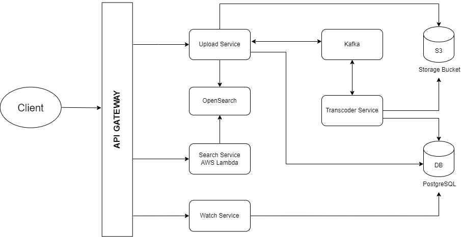

# Youtube - Video Streaming App

### Designed and Implemented a Youtube Clone Application where Users can upload and watch Videos.

### Tech Stack Used

```
Next JS, Node JS, Kafka, PostgreSQL, OpenSearch, AWS S3, Lambda.
```

## Architecture


### Functional Requirements
- Authentication: User Login and Logout with Google OAuth
- Video Upload to S3 (Chunking)
- Transcoding
- Adaptive Bitrate Streaming
- Search Videos

### Non Functional Requirements
- Availability
- Low Latency

### Microservices
- Upload Service
- Watch Service
- Transcoding Service
- Search Service

### Demo
[](https://www.youtube.com/watch?v=VmbiF5EL2To)
